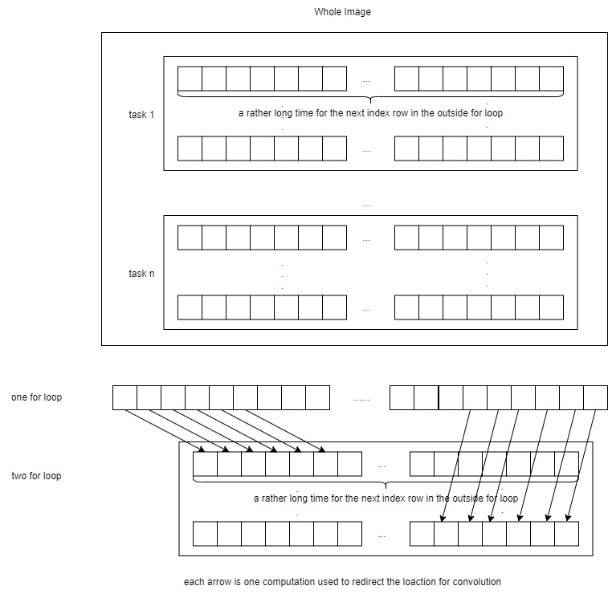
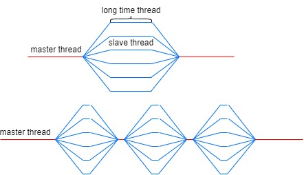

# [Project 1 ](https://github.com/tonyyxliu/CSC4005-2023Fall)

> Author: Zhen TONG 120090694

**Before everything**

This the first project for CSC4005, using different kinds of parallel programming skills to accelarate the smooth kernel in digital programming.

## Sequential

First, let's explore how we can optimize sequential programming to achieve its maximum potential. Instead of using a single array to store the data for all three color channels consecutively, I've opted for a more efficient approach by utilizing three separate arrays allocated in the heap to store this data. Due to Data Locality, storing each color channel in a separate array improves performance. This means that the pixels of each channel are stored contiguously in memory, reducing cache misses and improving memory access times. When processing an image sequentially, the CPU can fetch data more efficiently from contiguous memory locations, leading to faster image processing.

The next step involves breaking down the computation of a smooth kernel loop into explicit indices and performing convolution operations explicitly for each pixel within the kernel. This approach allows us to circumvent the overhead of setting up and executing additional redundant loops. This optimization is significant because the time taken by the compiler to construct a loop, the overhead of storing all data values in registers into memory, and retrieving them after the loop's completion are all time-consuming processes. Furthermore, in addition to the registers used to store data relevant to image processing, there are mechanisms in place for saving and restoring the program counter's state to memory positions before and after the loop, all of which contribute to unnecessary delays. Avoiding these operations is crucial to achieving a speed boost.

## SIMD(AVX2)

In the SIMD method, I employed AVX2 (ILP: Instruction-Level Parallelism) instructions to load data into registers and transform the sequential computing process into vectorized operations. Specifically, I utilized `_m128i` as an 8-byte register, allowing me to load 8 consecutive pixels within a channel simultaneously. Subsequently, I executed a for loop iteratively for each channel, repeating the convolution operation on sets of 8 pixels. This approach effectively enabled the vectorization of the convolution computation.


As depicted in the figure, we load eight `unsigned char` values into a single register for a single channel. By utilizing nine registers, we can carry out eight computations simultaneously, significantly enhancing processing efficiency.

The advantages of organizing data into a three-channel array become evident when considering AVX instructions. These instructions enable simultaneous execution of the same operation on multiple data elements. The storage structure aligns seamlessly with SIMD operations because it allows us to process all corresponding pixel values in parallel for each channel.

In detail, the code does the following things:

First, we create a SIMD register `__m256` called `one_ninth` to hold the reciprocal of 9, which will be used for the convolution calculation.

Next, we define a mask `__m128i` called `shuffle` that will be used for shuffling 32-bit integers to rearrange them in a specific order for storing results in a more efficient manner.

We then enter a loop that iterates through the image data. Within this loop, we load 3x8x(3x3) data, representing a 3x3 convolution kernel applied to 8 consecutive pixels. We organize the data for computation and loop through the three color channels: Red, Green, and Blue.

For each color channel, we load 8 bytes of pixel data at a time, convert them to 32-bit integers, and then to 32-bit floating-point values. We perform the convolution operation, multiplying each pixel value by `one_ninth` and accumulating the results in a SIMD register `color_convs_floats_8`.

After completing the convolution for all 9 pixels, we convert the results back to 32-bit integers. We then split the 256-bit SIMD register into two 128-bit registers, `low` and `high`, and use the `shuffle` mask to rearrange the integer values in the desired order.

Finally, we store the transformed results back into memory, and the process continues for the next set of pixels.

## MPI

MPI is  a multi process strategy (**Data-Level Parallelism (DLP)**). Because process has its own memory space, we need to assign a master process, and son process with their work field to work.AFter they finished thier work, we collect their work by send and recieve function in MPI. 

There is no need to give extra space for all son process to store all the image data, because they will not have chance to use them. In this task they only work on their on bunsiness field, and don't care for other thing. 

There is one strange thing in MPI. Because every process need to be assign a space of image to do the convoluion, they are allocated with a begining index of pixel in the image , and a end pixel in the image. Therefore we can simply use one for loop to do the convolution for each pixel in the for loop iteration, and output the answer. However, the performance is not good enough. A better way to do that is build a double for loop for rows and columns to iterativly compute the convolution. But why is that, why making one more for loop is better in this case. It is saving $O(MN)$ computation because in one for loop we still need to compute the location for a pixel in row-column representation. And for each pixel it is $O(1)$, for all the pixel, it is $O(MN)$, M, N is column number and row number. Using 2 for loop , we only need to compute the start row and end row for a sub- process, then all the thing is doing the 2 for loop from the start row to the end row. Another good thing is because we allocate the son process row by row, the first for loop actually takes a rather long time to be reconstruct in the stack , which means it can do a lot of things(doing convulution) in one row in the fisrt loop, the recourse wasting is not that bad.   



The program begins by initializing MPI, determining the number of processes, the rank of each process, and the hostname of the node it's running on. It then reads an input JPEG image, divides the image into smaller tasks, and allocates portions of the image to each process. This ensures that each process operates on its designated segment of the image.

The actual image processing happens in two parts. The master process (rank 0) performs the convolution for its assigned segment and also receives results from other processes. Slave processes perform convolution on their segments and send their results back to the master process. To efficiently manage data, each process calculates its start and end rows for convolution, optimizing performance. After convolution, the slave processes send their results to the master process using MPI communication.

Finally, the master process saves the filtered image and releases allocated memory. The code demonstrates how MPI can be used to parallelize image processing tasks effectively, distributing the workload among multiple processes to enhance performance on distributed systems.

## Pthread

Before we delve into OpenMP, let's first examine pthreads (POSIX Threads, **Thread-Level Parallelism (TLP)**). Pthreads utilize threads for parallelism, with the advantage of being lighter weight compared to processes. The approach is somewhat similar. We also favor employing row and column loops to iterate through all the pixels within each thread's task. 


In the pthread strategy, we need to create the thread data structure and the thread function. The thread data structure typically looks like this:

```cpp
// Structure to pass data to each thread
struct ThreadData {
    unsigned char* rChannels;
    unsigned char* gChannels;
    unsigned char* bChannels;
    unsigned char* output_buffer;
    int start;
    int end;
    int width;
    int height;
    int num_channels;
};
```

We use pointers for the three channel data because the threads share the heap data with other threads and the main process. Each thread is assigned a unique start and end pointer to specify the portion of data it should process. After all the threads finish their jobs, we use `pthread_join` to recollect their data.

##  OpenMP

OpenMP is a high-level programming paradigm for C++ (**Thread-Level Parallelism (TLP)**). It's essentially a pthread structure. In OpenMP, parallel tasks are simplified into instruction constructs, resembling hints to the compiler on how to utilize the hardware efficiently. However, compilers may not always be adept at allocating threads for optimal performance, such as determining the appropriate workload size for each thread. Therefore, it's essential to have a grasp of pthread strategies, which can guide us in designing efficient parallel programs using OpenMP.

The heuristic for workload allocation is to provide each thread with a sufficient amount of work, allowing them to operate efficiently without unnecessary time spent on communication. Utilizing OpenMP without careful consideration, such as implementing a straightforward thread-per-pixel or thread-per-row loop, can be suboptimal. The most efficient approach is to allocate threads with a chunk of data, ensuring that each thread performs its work in a way that minimizes redundant computations.



From this image, we can observe that as the individual thread's work time increases, the overall execution time of the parallel program decreases. Hence, it's crucial to determine the number of available cores and allocate the workload accordingly, similar to the pthread approach.

## CUDA

When employing CUDA(**Thread-Level Parallelism (TLP)**) for 2D image convolution, it's essential to leverage the inherent "single instruction multiple data" (SIMD) nature of CUDA. A CUDA kernel function, marked as `__global__`, can be invoked by the host and executed on the device. Within a grid, there are numerous 3D dimensional blocks, although we are employing only two dimensions here. In each block, we have multiple threads in a 3D dimensional arrangement. In the kernel function, we focus on the convolution centered around a single pixel. Therefore, there are `height * width` threads in total. Due to the limitations of block size (typically up to 1024 threads on many GPUs), we can only approach a (32, 32) block. To cover the entire image, we require a grid shape of approximately $(\lceil height/32\rceil, \lceil width/32\rceil)$. We opt for a 2D grid and block configuration because we aim to exploit data locality within the 2D image.

I attempted to employ a more fine-grained strategy, dividing each pixel thread into three separate threads for the RGB channels. However, this approach didn't yield significant benefits. Despite each thread performing less work, more time was consumed in communication, and there was a lack of data locality among the RGB channels.

An interesting observation is that when using (16, 16) block and (32, 32) block configurations, the performance difference is minimal, even though the latter is fully utilized.

I try to explain that larger block sizes may lead to more thread divergence. Thread divergence occurs when threads within a block follow different execution paths. If the threads within a block don't perform similar operations, it can lead to inefficiency, even if there are more threads.


## OpenACC

OpenACC(**Thread-Level Parallelism (TLP)**) is a high-level GPU paradigm that provides hints to the NVCC compiler to generate hardware code for GPU devices. Some crucial lines of code are positioned between the execution of the convolutional loop:

1. `#pragma acc enter data copyin(...)`: This directive is employed to allocate memory on the GPU and transfer data from the host (CPU) to the GPU. In this case, it's transferring the `filterImage` and `buffer` arrays from the host to the GPU. The `copyin` clause specifies that data should be copied from the host to the device, ensuring that the GPU has access to the necessary data.
2. `#pragma acc update device(...)`: This directive is used to update data on the GPU. It copies the same data as in the `enter data` directive but in the reverse direction, ensuring that the GPU has the most up-to-date data.
3. `#pragma acc parallel present(...)`: This directive defines a parallel region that will be executed on the GPU. It specifies the data that must be present on the device during the execution of this region. In this case, it lists the `filterImage` and `buffer` arrays as being present on the device.
4. `#pragma acc loop independent`: This directive is employed to signify that the iterations of the loop that follows are independent and can be executed in parallel. It enables the compiler to effectively parallelize the loop.
5. `#pragma acc exit data copyout(...)`: This directive is used to copy data from the GPU back to the host after the execution of the parallel region. It ensures that the modified `filterImage` array on the GPU is copied back to the host.


## Performance

| Number of Processes / Cores | Sequential                      | SIMD (AVX2)                     | MPI                             | Pthread | OpenMP                          | CUDA    | OpenACC                       |
| --------------------------- | ------------------------------- | ------------------------------- | ------------------------------- | ------- | ------------------------------- | ------- | ----------------------------- |
| 1                           | <font color = green>6661</font> | <font color = green>2878</font> | <font color = green>6156</font> | 6282    | <font color = black>8284</font> | 19.6351 | <font color = green>20</font> |
| 2                           | N/A                             | N/A                             | <font color = green>5922</font> | 5629    | <font color = green>6468</font> | N/A     | N/A                           |
| 4                           | N/A                             | N/A                             | <font color = black>3349</font> | 2925    | <font color = green>3294</font> | N/A     | N/A                           |
| 8                           | N/A                             | N/A                             | <font color = green>1689</font> | 1586    | <font color = green>1654</font> | N/A     | N/A                           |
| 16                          | N/A                             | N/A                             | <font color = black>1102</font> | 749     | <font color = green>903</font>  | N/A     | N/A                           |
| 32                          | N/A                             | N/A                             | <font color = black>716</font>  | 482     | <font color = green>466</font>  | N/A     | N/A                           |


## How to Run

**build, run, store in one instruction**

I have packed all the things in `./run.sh`, first give permission, then run

```
chmod +x ./run.sh
./run.sh
```

All the running results will be stored the image files with each parallel strategy on file directory. The tiime cose log will be stored in the `Project1-PartB-Results.txt`

You can also separately fun compile and run

```
# Change directory to 'build/'
cd build/

# Run 'make' with 4 parallel jobs
make -j4

# Change back to the parent directory
cd ..

# Submit the job to SLURM using 'sbatch'
sbatch src/scripts/sbatch_PartB.sh
```

The output image should be in the `images` folder


