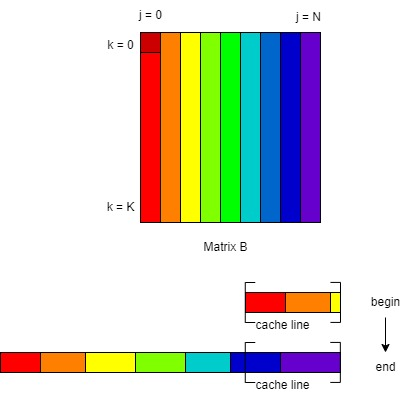
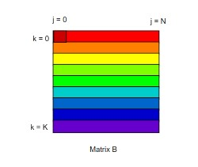
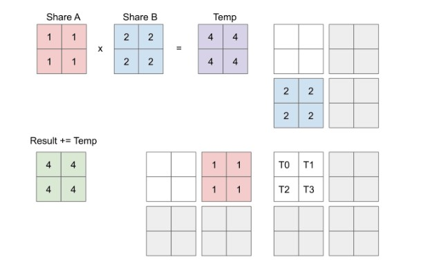
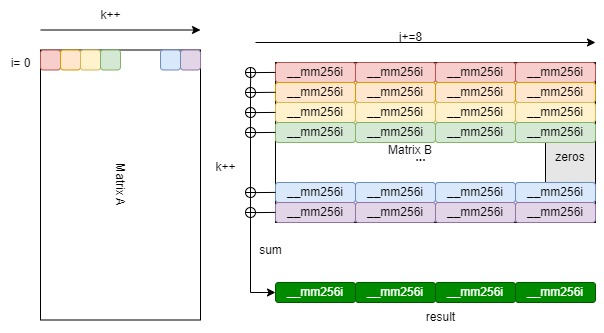
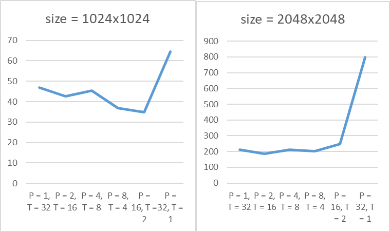
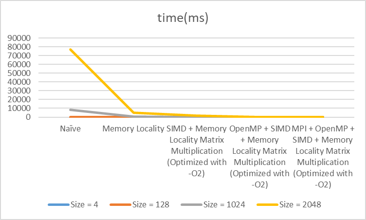
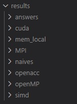

# Matrix Multiplication Parallelism

> Author: Zhen Tong 120090694@link.cuhk.edu.cn

## Before Everything

This project implement these program for matrix multiplication:

- Memory locatity
- SIMD (AVX2) + Memory locatity
- openmp + SIMD (AVX2) + Memory locatity
- MPI + openmp + SIMD (AVX2) + Memory locatity
- CUDA

You can find the performance in the `/profiling` directory, and check the output matrices in `/results` dierectory

The matrix multiplication in math form is:
$$
c_{ij} = \sum_{k = 0}^Ka_{ik}b_{kj}
$$
$a_{ik}, b_{kj}$ are two element of matrix $A$ and $B$, and$c_{ij}$​ in this equation is the element in the result matrix. An very naive way of doing this task is using three for loop Therefore, the naive code is:

```cpp
for (size_t i = 0; i < M; ++i) {
    for (size_t j = 0; j < N; ++j) {
        for (size_t k = 0; k < K; ++k) {
            result[i][j] += matrix1[i][k] * matrix2[k][j];
        }
    }
}
```

However, this implementation can be trouble when the matrix is large.

## [Task1: Memory Locality](https://github.com/tonyyxliu/CSC4005-2023Fall/tree/main/project2#task1-memory-locality)

The naive implementation can cause problem, because it doesn't fully use the memory locality and each time they visit the data, the cache missed. More specific, the element matrix $B$ is visiting can not be held in the cache for a long time. For example, to compute the first iteration of the first loop the matrix $B$ needs to visit from <font color = red>red</font> to <font color = "purple">purple</font>, crossing the rainbow🌈 from left to right. The next time the program want to visit the element $b_{0,0}$ the deep red element is not in the cache, causing a cache miss. What's worse, the whole Matrix needs to load to the cache again if the matrix is so large that the cache cannot store. Another bad thing is the for loop goes in vertical direction, but our memory in `Matrix` is implemented in horizontal aligned manner. Visiting the data in vertical order damage the special locality.



There are two way to achieve the memory locality. Reorder the for loop or using tiled matrix multiplication.

**Reordering the loop**

The simplest approach is using the loop as follows:

```cpp
for(size_t i = 0; i < M; ++i){
    auto mat1_ptr_i = matrix1[i];
    auto mem_result_ptr_i = result[i];
    for(size_t k = 0; k < K; ++k){
        auto mat2_ptr_k = matrix2[k];
        auto mat1_ik = mat1_ptr_i[k];
        for(size_t j = 0; j < N; ++j){
            mem_result_ptr_i[j] += mat1_ik*mat2_ptr_k[j];
        }
    }
}
```

There are four thing for this implementation:

1. **Cache Efficiency**: In this code, accessing elements of `matrix1`, `matrix2`, and `result` in a contiguous manner can give us the cache line benifits. This sequential access pattern can take better advantage of the cache hierarchy. Modern CPUs have caches with different levels (L1, L2, L3), and they work most efficiently when you access memory in a predictable, linear fashion. By iterating through the data in this way, you are more likely to reuse data stored in the cache.

2. **Data Reuse**: The code minimizes the number of cache misses by reusing the values stored in `mat1_ik`, `mat2_ptr_k`, and `mem_result_ptr_i` within inner loops. This means that the data is loaded into the cache once and reused multiple times, reducing the need to fetch data from main memory.

3. **Spatial Locality**: The innermost loop accesses elements of `mat1_ik` and `mat2_ptr_k` sequentially. Spatial locality is the principle that data items that are stored close together in memory tend to be accessed together. In this case, the elements are accessed in the order they are stored in memory, which improves spatial locality.

   

**Using tiled matrix multiplication**

Because each element of the result matrix is computed by the inner product of a whole row of matrix A and a whole column of matrix B. The row or column may be too large for the cache to hold until the next4 use. therefore divide the large matrix into small matrix can help.



[^Picture Source]:  https://penny-xu.github.io/blog/tiled-matrix-multiplication

```cpp
    for(size_t ti = 0; ti < numtile_M; ++ti){
        for(size_t tj = 0; tj < numtile_N; ++tj){
            for(size_t tk = 0; tk < numtile_K; ++tk){
                // do the tile matrix multiply for tile_num_K x tile_num_K times

                size_t row_offset = ti * tile_sizeM;
                size_t col_offset = tj * tile_sizeN;
                size_t mid_offset = tk * tile_sizeK;
                for(size_t i = 0; i < tile_sizes_M[ti]; ++i){
                    for(size_t j = 0; j < tile_sizes_N[tj]; ++j){
                        for(size_t k = 0; k < tile_sizes_K[tk]; k++){
                            memresult[row_offset+i][col_offset+j]+=
                            memM1[row_offset+i][mid_offset+k]*
                            memM2[mid_offset+k][col_offset+j];
                        }
                    }
                }
            }
        }
    }
```

| Methods             | Matrices 1024*1024 | Matrices 2048*2048 |
| ------------------- | ------------------ | ------------------ |
| Naive               | 8098 ms            | 84232 ms           |
| Reordering the loop | 776 ms             | 6451 ms            |
| Speedup             | 1043.6%            | 1305.7%            |

##### Profiling

In the 2048x2048 matrix case:

1. Cache Performance: The memory-locality implement has a lower cache miss rate (23.919%) compared to the naive algorithm (33.424%). Lower cache misses generally lead to better performance.
2. Page Faults: The locality-aware algorithm has fewer page faults (30,690) compared to the naive algorithm (54,517). Fewer page faults indicate better memory access patterns.
3. IPC: The locality-aware algorithm achieves a higher Instructions per Cycle (IPC) of 2.79, while the naive algorithm has a lower IPC of 1.10. A higher IPC suggests better instruction-level parallelism and more efficient execution.

## [Task2: Data-Level Parallelism](https://github.com/tonyyxliu/CSC4005-2023Fall/tree/main/project2#task2-data-level-parallelism)

Using AVX2 we can reach a better parallelism performance by vecterization. The SIMD should be based on the memory locality approach. For each element in row i in matrix A, it will do scale multiply with a vector $[b_{k,j}, b_{k, j+1}, b_{k, j+2}, b_{k, j+3}, b_{k, j+4}, b_{k, j+5},b_{k, j+6}，b_{k, j+7}, b_{k, j+8}]$. To fully use the memory locality we do the row of matrix $B$ continuously. After that we multiply the second element at row i in $A$ with the second row in matrix $B$, so on so forth. Finally, we add these multiplied vectors up along the K dimension, and we can get a row of result vector. Another tips is expand the small for loop can further speedup.



| Methods             | Matrices 1024*1024 | Matrices 2048*2048 |
| ------------------- | ------------------ | ------------------ |
| Reordering the loop | 776 ms             | 6451 ms            |
| SIMD (AVX2)         | 233 ms             | 1839 ms            |
| Speedup             | 333.05%            | 350.79%            |

##### Profiling

In the 2048x2048 matrix case:

**CPU Cycles and Instructions:** The SIMD implementation had fewer CPU cycles (7,786,145,349) and fewer instructions (21,257,516,541) compared to the mem_local implementation (20,733,443,452 cycles and 57,790,022,221 instructions). This suggests that the SIMD implementation was more efficient in terms of CPU resource usage.

## [Task3: Thread-Level Parallelism](https://github.com/tonyyxliu/CSC4005-2023Fall/tree/main/project2#task3-thread-level-parallelism)

In my experiment, the tiled method is not that suitable for the openmp multiple thread level parallelism. Therefore, I use `openmp` with only reordering and vectorization. Because the loop size in the for loop is concrete, therefore I use the static schedule to speedup the `omp parallel for` .

```cpp
#pragma omp parallel for schedule(static)
for(size_t i = 0; i < M; i++){
    // load the row pointer of M1 from 1 to 8 into an array
    auto mat1_row_ptr = matrix1[i];
    __m256i  row_vec_i[N/8+1];
    for(int x = 0; x < N/8+1; x++){
        row_vec_i[x] = _mm256_setzero_si256();
    }
    for(size_t k = 0; k < K; k++){
        // auto mat1_ik = mat1_row_ptr[k];
        auto mat1_ik = mat1_row_ptr[k];
        auto mat2_row_ptr = matrix2[k];
        __m256i mat1_i_vec = _mm256_set1_epi32(mat1_ik);
        for(size_t j = 0; j < N; j+=8){
            __m256i  mat2_kj = _mm256_loadu_si256((__m256i*)&mat2_row_ptr[j]);
            row_vec_i[j/8] = _mm256_add_epi32(_mm256_mullo_epi32(mat1_i_vec, mat2_k
        }
    }
    // load out the row vector into the result
    int * mem_result_row_ptr = result[i];
    for(int y = 0; y < N/8+1; y++){
        _mm256_storeu_si256((__m256i*)&mem_result_row_ptr[y*8], row_vec_i[y]);
    }
}
return result;
```

| Methods     | Matrices 1024*1024 | Matrices 2048*2048 |
| ----------- | ------------------ | ------------------ |
| SIMD (AVX2) | 233 ms             | 1839 ms            |
| openmp      | 44 ms              | 204 ms             |
| Speedup     | 529.54%            | 901.47%            |

**Efficiency**

| #threads | 1024x1024 time(ms) | Efficiency | 2048x2048 time(ms) | Efficiency |
| -------- | ------------------ | ---------- | ------------------ | ---------- |
| 1        | 202                | 1          | 1869               | 1          |
| 2        | 200                | 0.505      | 1873               | 0.498932   |
| 4        | 115                | 0.43913    | 995                | 0.469598   |
| 8        | 69                 | 0.365942   | 515                | 0.453641   |
| 16       | 43                 | 0.293605   | 321                | 0.363902   |
| 32       | 41                 | 0.153963   | 206                | 0.283525   |


##### Profiliing

In 2048x2048 matrix case:

1. **Execution Time**: The OpenMP approach is significantly faster, taking only 206 milliseconds, while SIMD AVX2 vectorization took 1833 milliseconds. OpenMP outperforms SIMD in terms of execution time.
2. **Cache Performance**: The OpenMP approach has a lower cache miss rate (12.841%) compared to SIMD (27.148%). A lower cache miss rate is generally desirable for better performance, so OpenMP has an advantage here.
3. **Instructions per Cycle**: The OpenMP approach has a lower instructions-per-cycle ratio (1.49) compared to SIMD (2.73). A lower ratio indicates better instruction-level parallelism, which can contribute to better performance.
4. **User and System Time**: OpenMP has higher user time (6.228936 seconds) compared to SIMD (2.9611 seconds). User time measures the time spent executing the application code, so OpenMP seems to be more computationally intensive. The system time for both approaches is relatively low.

## [Task4: Process-Level Parallelism](https://github.com/tonyyxliu/CSC4005-2023Fall/tree/main/project2#task4-process-level-parallelism)

The MPI implementation is first divide the rows of result matrix into `process_num `division. Then use MPI communication. The performance is:

| Methods       | Matrices 1024*1024 | Matrices 2048*2048 |
| ------------- | ------------------ | ------------------ |
| P = 1, T = 32 | 49                 | 220                |
| P = 2, T = 16 | 45                 | 274                |
| P = 4, T = 8  | **33**             | 213                |
| P = 8, T = 4  | 35                 | **200**            |
| P = 16, T = 2 | 36                 | 259                |
| P = 32, T = 1 | 64                 | 463                |
| Best speedup  | 133.33%            | 102%               |

This is the figure of the time cost of different setting.



##### Profiling Analysis

Compare 32 threads openmp with 16 process 2 threads MPI:

1. **Execution Time:** The OpenMP implementation is faster with an execution time of 206 milliseconds compared to 259 milliseconds for the MPI with OpenMP implementation.
2. **Cache Performance:** The OpenMP implementation has a lower cache miss rate (12.841%) compared to the MPI with OpenMP implementation (90.471%). Lower cache miss rates are generally better for performance.
3. **Page Faults:** The OpenMP implementation has slightly more page faults (17,028) compared to the MPI with OpenMP implementation (10,182).
4. **Total Cycles and Instructions:** The OpenMP implementation has higher total cycles and instructions, indicating more processing work. The MPI with OpenMP implementation has fewer cycles and instructions, which could be due to fewer threads and processes.
5. **User and System Time:** The OpenMP implementation has higher user time, which suggests that more computational work is being done by the user's code. The system time is lower for both implementations.

Compare 32 processes MPI, and 16 process 2 thread:

1. **Execution Time:**
   - Configuration 2 (2 processes, 16 threads) is significantly faster, taking only 47 milliseconds, compared to Configuration 1 (32 processes, 1 thread), which took 463 milliseconds. Configuration 2 is approximately 10 times faster.
2. **Cache Performance:**
   - Configuration 1 experienced a high cache miss rate (89.27% of cache references), indicating a high level of cache inefficiency.
   - Configuration 2 had a much lower cache miss rate (1.56% of cache references), suggesting more efficient cache utilization.
3. **Page Faults:**
   - Configuration 2 had fewer page faults (5,045) compared to Configuration 1 (14,126), indicating a better memory access pattern in Configuration 2.
4. **CPU Utilization:**
   - Configuration 2 utilized more CPU resources in terms of user time (1.038 seconds) compared to Configuration 1 (3.059 seconds).
   - System time was lower in Configuration 2 (0.048 seconds) compared to Configuration 1 (0.126 seconds).

If we set the thread number to 1, and change the process number:

| #process | 1024x1024 time (ms) | Efficiency | 2048x2048 time(ms) | Efficiency |
| -------- | ------------------- | ---------- | ------------------ | ---------- |
| 1        | 257                 | 1          | 2583               | 1          |
| 2        | 234                 | 0.455253   | 2378               | 0.460317   |
| 4        | 132                 | 0.128405   | 1220               | 0.11808    |
| 8        | 89                  | 0.043288   | 747                | 0.03615    |
| 16       | 61                  | 0.014835   | 427                | 0.010332   |
| 32       | 64                  | 0.007782   | 463                | 0.005602   |

This is the figure of the table above


Finally, this figure summary the thing we did on cpu:


## Extra Task: GPU Parallelism

In the GPU acceleration, I implement it in CUDA. Choose the thread block to be 16x16.

```cpp
int thread_num_x = 16/* Choose an appropriate number of threads per block */;
int thread_num_y = 16;
// Determine the grid dimension.
int blocksPerGridY = (N + thread_num_y - 1) / thread_num_y;
int blocksPerGridX = (M + thread_num_x - 1) / thread_num_x;
```

Then launch the kernel function:
```cpp
dim3 blockDim(thread_num_x, thread_num_y);
dim3 gridDim(blocksPerGridX, blocksPerGridY);    
matrix_multiply_cuda<<<gridDim, blockDim>>>(d_mat1, d_mat2, d_result, M, N, K);
```

In the kernel function, each thread compute one element in the result matrix. Tiled implementation can be better because the GPU cache is small and only the small range of data in the tile can be reused.

In the GPU parallelism the `cuda `is:

| Methods | Matrices 1024*1024 | Matrices 2048*2048 |
| ------- | ------------------ | ------------------ |
| cuda    | 31.6947 ms         | 205.236 ms         |

## How to Run

##### Run in bash

```bash
chmod +x ./run.sh
./run.sh
```

Test robustness: I generated some cases for matrix multiply to test the program robustness

```
./robust_run.sh
```

Then, you check the result matrixs in `results`



##### Run each task

<font color = red>**Important:** If you are testing data not in the range of `results/answer` please switch of the debug arg to 0 in bash or instruction</font> The debug is used to check the answer correctness for developer (ME).

`debug=0`

- Task 1

  ```bash
  sbatch src/scripts/task1.sh 
  # OR RUN ONE PROGRAM
  srun -n 1 --cpus-per-task 1 /build/src/locality  <matrix1.txt> <matrix2.txt> <result.txt> <debug>
  ```

- Task2
  ```bash
  sbatch src/scripts/task2.sh 
  # OR RUN ONE PROGRAM
  srun -n 1 --cpus-per-task 1 /build/src/simd <matrix1.txt> <matrix2.txt> <result.txt> <debug>
  ```

- Task3
  ```bash
  sbatch src/scripts/task3.sh 
  # OR RUN ONE PROGRAM
  srun -n 1 --cpus-per-task <threads_num> /build/src/openmp <threads_num> <matrix1.txt> <matrix2.txt> <result.txt> <debug>
  ```

- Task4
  ```bash
  sbatch src/scripts/task4.sh 
  # OR RUN ONE PROGRAM
  srun -n <process_num> --cpus-per-task  --mpi=pmi2 /build/src/mpi <threads_num> <matrix1.txt> <matrix2.txt> <result.txt> <debug>
  ```

- Task5-cuda
  ```bash
  sbatch src/scripts/task5.sh 
  # OR RUN ONE PROGRAM
  srun -n 1 --gpus 1 /build/src/gpu/cudaMul <matrix1.txt> <matrix2.txt> <result.txt> <debug>
  ```


- What have you found from the experiment results?

## Reference

[reference 1](https://www.codeproject.com/Articles/874396/Crunching-Numbers-with-AVX-and-AVX)

[reference 2](https://lzzmm.github.io/2021/09/10/GEMM/)

[Instruction on Profiling with perf and nsys](https://github.com/tonyyxliu/CSC4005-2023Fall/blob/main/docs/Instruction on Profiling with perf and nsys.md) 
