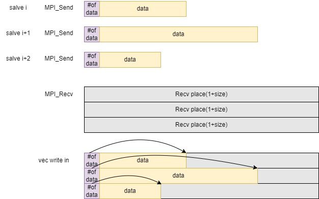
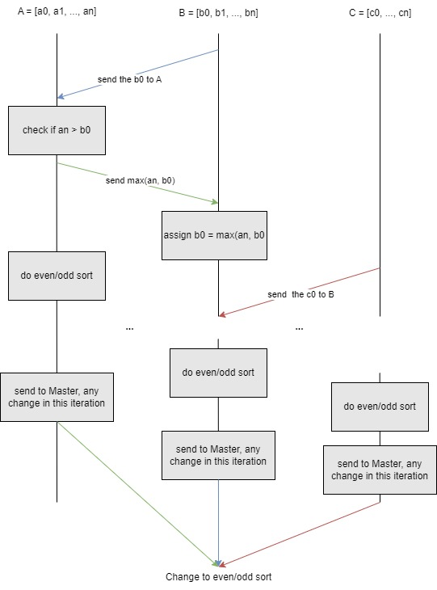
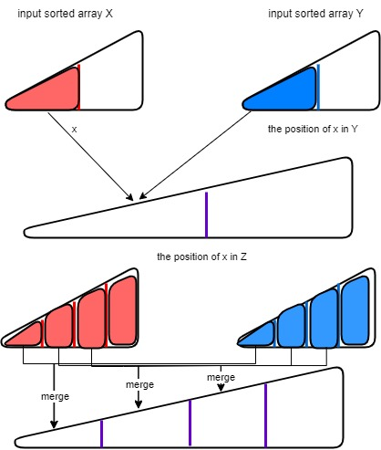

# Project 3 Sorting

## Quick Sort with MPI

In the quick sort with multi-process parallel code, the sort is being done in chunks, and the output of the sort function is $P$ number of sorted array. $P$ is the number of process. To fully use all the computing resource, the master is working with slaves, and counted in $P$. In a even divided array, each process is sorting with quick sort algorithm, which is $O(\frac{N}{P}\log\frac{N}{P}) $. Then, all the process send the data back to the Master node, which takes $t_{trans}\times N$ amount of time. And later, merge $P$ number of sorted array into the output array. The time complexity of merge is $O(N)$, and we use the heap to  store the smallest element of $P$ arrays. When the smallest element pops out, we stack the next element of the same array to the heap, which takes $O(\log P)$ time. So, the overall merging is $O(N\log P)$, and the overall time complexity of Quick Sort with MPI is 
$$
O(\frac{N}{P}\log\frac{N}{P}) +t_{trans}\times N+O(N\log P)
$$


## Bucket Sort with MPI

The idea of Bucket Sort is first divide the array into some bucket interval, sorted the bucket, and merge data with $O(1)$. The motivation of this algorithm the merging time is small, however the divide data into bucket can cost $O(N)$. In the MPI code, we first get the range of the data$O(N)$, and then get the each bucket range divided the data range by the bucket number.  Then, we allocate the buckets to the processes, and let them do the data division. After that, use insertion sort in each bucket. The master is prepared $M\times N$ space to receive data. $M$ is the number of all buckets, and $N$ is the number of the total array. The `MPI_Send()` function will send a structure of  `[#data, data]`, we need to tell how many data in one bucket, so that the master can move the data into the vector.




Indeed, the number of buckets in a bucket sort algorithm can significantly impact its performance. The choice of the number of buckets affects the balance between the size of each bucket and the number of comparisons and movements required during the sorting process.

**Bucket Size:**

Having too few buckets may lead to large bucket sizes, which could result in inefficient sorting within each bucket. If a bucket becomes too large, it might be better to use a more efficient sorting algorithm, such as insertion sort, within that bucket. In the experiment, for array size as $10^8$, bucket size is $10^6$.

**Numerical Analysis **


## Odd-Even Sort with MPI

The Odd-Even Sort is not a good algorithm in sequential, because it takes $O(N^2)$  amount of time. However, because it is not data dependent in each iteration, it is good for parallel. The key point in MPI is the check the edge of the array to see, whether two adjacent process need to exchange data.



There is a trick in this question, we know that the MPI communication can be very expansive, and send the last signal `sorted = ture/false` can be too trivial to send. Therefore, we can first assume that the with $10$ to $100$ iteration (take $24$ in experiment), we can check sorted for one time. We can do useless multiple iteration in return of saving expensive MPI Communication. For example, if the iteration time itself with out MPI Communication with Master is $t_1$, and the total time of communication with master and all slave is $t_2$. And we do $n$ times of iteration with one central communication. Then, we are saving amount of time overall.
$$
\frac{T}{n}\times t_2-t_1
$$

## Merge Sort with OMP(Bonus)

The merge sort is divide into two steps: the independent neighborhood sort, and recursive merge. The Sorting parallel is simple, we set the maximum number `n` number of thread to sort in `n` sub-arrays. The most difficult part is the merge parallelism. The way to merge independently and using parallelism first find the position of element $x$ in the right array $Y$, and the position of $x$ in output array $Z$ using binary sort. Assume we have $t$ number threads to use in one merge function, we need to fund the position of $x_1, x_2, ..., x_{t-1}$, then we can let the thread to do sub-merge for $X[i, {i+1}]$, and $Y[pos_Y(x_i), pos_Y(x_{i+1})]$ , and write the output in the output array $Z[pos_Z(x_i), pos_Z(x_{i+1})]$. The time complexity is $O(t\log N)$ for binary search, plus $O(N/t)$ parallel merge. 



The binary search mentioned above is not really doing the binary search, but to return the rightmost element of the array.

```cpp
int binarySearch(vi &vec, int val) {
    int low = 0;
    int high = vec.size();

    while (low < high) {
        int mid = low + (high - low) / 2;

        if (vec[mid]<= val) {
            low = mid+1;
        } else {
            high = mid;
        }
    }
    return low; // Returns the rightmost position
}
```

Although the performance degrade when thread number exceed 16, I try my best to control the thread distribution. The thread thread strategy is like this. Suppose there are $T$ number of threads

- When there are $M$ sorted array being merge, there are $M/2$ threads are doing the merging job
- In each merging job, there are $T-M/2$ threads ideal, therefore I set $k = \frac{T-M/2}{M/2}$ threads for the parallel merging job for 2 sorted array. 
- Therefore, the $k$ threads need to first do $k-1$ numbers of binary sequential, and then do $k$ parallel merging between two array.

## Performance

**My Time Cost**

| Workers | QuickSort(MPI) | BucketSort(MPI) | Odd-Even-Sort(MPI) | MergeSort(Threads)           | QuickSort(Threads)           |
| ------- | -------------- | --------------- | ------------------ | ---------------------------- | ---------------------------- |
| 1       | 14391          | 11500           | 37240              | 12070                        | 12642                        |
| 2       | 12690          | 7877            | 31547              | 6741                         | <font color=red>18162</font> |
| 4       | 9145           | 4476            | 19561              | 4837                         | <font color=red>18079</font> |
| 8       | 8177           | 2559            | 11544              | 4180                         | <font color=red>18069</font> |
| 16      | 7886           | 1691            | 6476               | <font color=red>9176</font>  | <font color=red>18162</font> |
| 32      | 8397           | 1276            | 3598               | <font color=red>17972</font> | <font color=red>18298</font> |

**Baseline**

| Workers | QuickSort(MPI) | BucketSort(MPI) | Odd-Even-Sort(MPI) | MergeSort(Threads) | QuickSort(Threads) |
| ------- | -------------- | --------------- | ------------------ | ------------------ | ------------------ |
| 1       | 13708          | 11669           | 37077              | 25510              | 13006              |
| 2       | 12451          | 8901            | 29069              | 20431              | 10879              |
| 4       | 9093           | 5107            | 18603              | 10539              | 7804               |
| 8       | 7979           | 3457            | 11561              | 5537               | 4566               |
| 16      | 8014           | 2583            | 7418               | 3447               | 3808               |
| 32      | 8849           | 2469            | 5919               | 2063               | 3597               |


- In the speed up, the odd-even algorithm parallel is the most linear-like case, this is because the MPI Communication is evenly distributed into the iteration, and we take a trick that the more slave we need to communicate, the less frequent our loop communicate to check stop. 
- The Quick Sort and the Bucket Sort's speedup is not as good as odd-even sort, because the merge of quick sort is sequential, and the heap size of the priority tree is getting bigger in merging state. 
- The Bucket Sort's efficiency is better the other 2 sort algorithm, because there is no increase of sequential part. 

**Profiling Results & Analysis with `perf`**

- Quick Sort
  - **Cache Misses and References:**
    - The number of cache misses decreases as the number of cores increases, indicating potential improvements in cache utilization.
    - Cache reference percentages show how often cache was successfully referenced. Some variability is observed, possibly due to the nature of the workload or cache behavior.
  - **Cache Reference Percentage:**
    - Generally, the cache reference percentage increases with the number of cores, suggesting better cache utilization as parallelism increases.

- Bucket Sort

  - **Cache Miss:**
    - The number of cache misses first increase then decrease, because the increase is because data dependency was destroyed by dividing data into different process. However, the cache misses then decrease because, there are few data to deal with ,and there are also fewer cold cache miss.

- Odd-Even Sort

  - **Cache Misses and Cache References:**

    - Cache References generally decreases. 

    - The cache reference percentage is the percentage of cache references compared to the total number of cache accesses. It indicates the efficiency of cache utilization.
    - The percentage starts relatively low for 1 core and 2 cores, but significantly increases for 4 cores and beyond. This could be due to the parallel nature of the algorithm, where more cores result in a higher rate of cache references.

  - **Number of Instructions:**

    - The number of instructions executed increases with the number of cores, with the highest value at 16 cores. This increase in instructions may be attributed to the parallelization overhead and the execution of more instructions in parallel across multiple cores.


### Recommendations:

- **Cache Optimization:**
  - Analyze cache miss patterns to identify opportunities for optimization, such as improving cache locality or restructuring data.
- **Parallel Efficiency:**
  - Evaluate parallel efficiency and scalability by comparing cache references and misses across different core counts.
- **Load Balancing:**
  - Consider load balancing to ensure an even distribution of work among cores, reducing the potential for cache contention.

## How to Run My Code

You can compile the code and run the code with one line.

```shell
chmod +x run.sh
./run.sh
```

Or you can manually compile the code, and run the sbatch, the output will be in the `log/Project3.txt`, and log `log/bonus.txt`

```shell
# Compile the src code in build
mkdir build 
cd build
cmake ..
make -j4

# Run
cd ..
sbatch src/sbach.sh
sbatch src/sbach_bonus.sh
```

Or you can run the tasks separately after compile. The output of `perf` will be in the `log/task*.txt`

```shell
# change permision to +x first
sbatch src/scripts/task1.sh 
sbatch src/scripts/task2.sh 
sbatch src/scripts/task3.sh 
```

Or you can execute the code with DIY parameter 

```bash
perf_command="perf stat -e cycles,instructions,cache-references,cache-misses"
```

- ```shell
  srun -n $num_cores --cpus-per-task 1 --mpi=pmi2 $perf_command ${CURRENT_DIR}/../build/src/quicksort/quicksort_mpi ${big_size}
  ```

- ```shell
  srun -n $num_cores --cpus-per-task 1 --mpi=pmi2 $perf_command ${CURRENT_DIR}/../build/src/bucketsort/bucketsort_mpi ${big_size} ${big_bucket}
  ```

- ```shell
  srun -n $num_cores --cpus-per-task 1 --mpi=pmi2 $perf_command ${CURRENT_DIR}/../build/src/odd-even-sort/odd-even-sort_mpi ${oddeven_size}
  ```

**`perf` analysis**

using my python code `analysis.py` it will extract the import data and do statistic for you, using useful **regular expression**

```bash
python3 analysis.py 
```

## Appendix

Table of data collected in the `perf` commend.

**Quick Sort with MPI**

| Cores                | 1           | 2           | 4           | 8           | 16          | 32          |
| -------------------- | ----------- | ----------- | ----------- | ----------- | ----------- | ----------- |
| cache<br/>miss       | 158025980.0 | 80729914.0  | 44110473.0  | 24038915.0  | 15048559.5  | 10519799.4  |
| cache<br/>reference  | 230906748.0 | 118512881.0 | 64081817.5  | 33488426.8  | 19911586.6  | 14133144.1  |
| cache<br/>reference% | 68.437      | 66.221      | 65.43725    | 68.983625   | 74.95175    | 74.2        |
| instruction<br/>num  | 542293108.0 | 670668560.0 | 593783905.0 | 602958409.5 | 437816684.6 | 667951908.6 |

**Bucket Sort with MPI**

| Cores                | 1           | 2           | 4           | 8           | 16          | 32          |
| -------------------- | ----------- | ----------- | ----------- | ----------- | ----------- | ----------- |
| cache<br/>miss       | 334679367.0 | 181321147.0 | 95741341.7  | 62101736.12 | 46433108.5  | 38768590.8  |
| cache<br/>reference  | 477131827.0 | 259117596.0 | 141852335.7 | 84185615.5  | 56938498.0  | 43872005.5  |
| cache<br/>reference% | 70.144      | 69.769      | 66.81775    | 73.7505     | 82.3455625  | 89.3684375  |
| instruction<br/>num  | 609065074.0 | 547796687.0 | 449616108.0 | 588080301.3 | 509110032.1 | 456636856.3 |

**Odd-Even Sort with MPI**

| Cores                | 1           | 2           | 4            | 8           | 16          | 32            |
| -------------------- | ----------- | ----------- | ------------ | ----------- | ----------- | ------------- |
| cache<br/>miss       | 189906.0    | 411674.0    | 2327726.5    | 3162682.5   | 3545464.625 | 3524768.625   |
| cache<br/>reference  | 857956879.0 | 345477901.0 | 6620118.25   | 3424899.625 | 3998650.375 | 4695187.75    |
| cache<br/>reference% | 0.022       | 0.121       | 55.1         | 91.1        | 88.4        | 67.6          |
| instruction<br/>num  | 222015385.0 | 554048876.5 | 485595380.25 | 477382203.2 | 629073048.3 | 473586805.375 |


