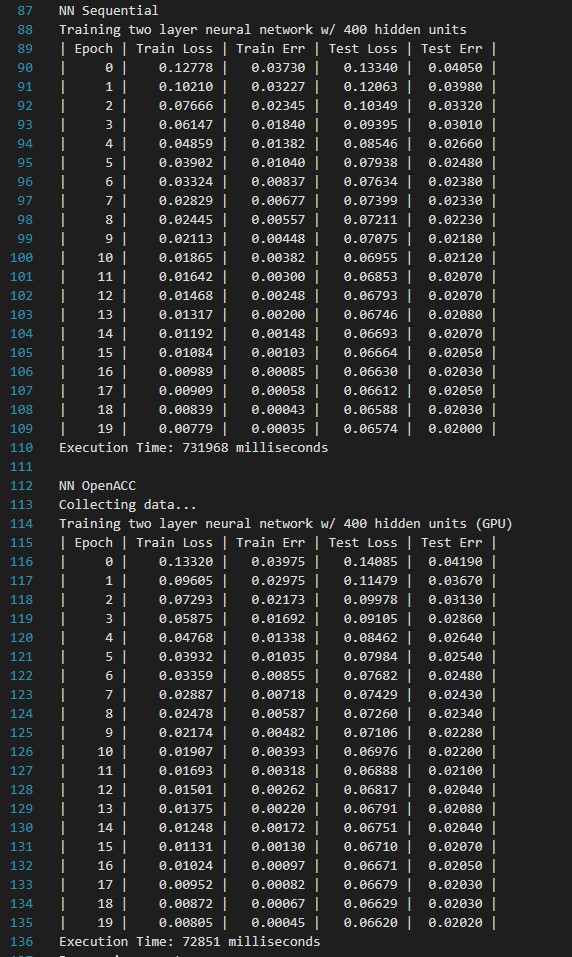

# Project 4: Parallel Programming with Machine Learning

> Author: Zhen Tong 120090694@link.cuhk.edu.cn

## Before Everthing

This is a project involving the C++ implementation of a neural network, specifically focusing on softmax regression and multilayer perceptron (MLP), utilizing stochastic gradient descent (SGD) training on the MNIST dataset. The project is organized into four tasks:

- Task1: Sequential softmax regression implemented in C++
- Task2: CUDA parallelized softmax regression using OpenACC
- Task3: C++ implementation of a neural network (NN)
- Task4: CUDA parallelized neural network using OpenACC

## Task 1


As the figure above, there is only three steps in the forward computation:

1. Use the matrix dot product to get the linear permutaion.
2. Use the softmax $\sigma(\cdot)$ and get the normalized matrix
3. get the maximum index of the softmax as the output.

Because we are doing the classification work, the loss is still the entropy loss. As for the training and parameter update, follow the fomula:
$$
l_{\text{softmax}}(z, i) = -\log\sigma(z_i), \text{(where i is the label index)}\\
=-\log\frac{\exp(f(x)_i)}{\sum_{j = 0}^{j < k}\exp(f(x)_j)}\\
=-f(x)_i + \log\sum_{j = 0}^{j<k}\exp(f(x)_j), \\
\nabla_\theta l_{\text{softmax}}(X\Theta, y) =\frac{1}{m}X^T(Z-I_y)\\
\text{m is the batch size, } Z = normalize(X\Theta), I_y\in \mathbb{R}^{m\times k}\text{is the concatenated one-hot vector}\\
\theta' = \theta -\alpha\nabla l_{\text{softmax}}
$$
In the sequential implementation, to enhance program speed, attention should be directed toward optimizing locality. When the size of the last dimension, specifically the second dimension of the second matrix, is unknown, a general form can be employed. Two key strategies involve precomputing the pointer in advance for efficient data retrieval and reordering the sequence of nested loops to maximize data locality for a row in a matrix.

```cpp
for(size_t i = 0; i < m; i ++){
    auto A_row = A + i*n; // compute the pointer ahead of time, and repeatedly use 
    auto C_row = C + i*k;
    for(size_t l = 0; l < n; l++){
        auto B_row = B + l*k;
        float A_il = A_row[l];
        for(size_t j = 0; j < k; j++){ // change the for loop sequence for locality
            C_row[j] += A_il*B_row[j];
        }
    }
}
```

For matrix that need to first transpose than multiply, we directly multiply them leveraging the locality according to one principle: **inner loop locality serve first.**  For example: $A^TB$, we exanage dimension m, and n.

```cpp
for(size_t x = 0; x < n; x++){
    auto A_row = A + x*m;
    auto B_row = B + x*k;
    for(size_t i = 0; i < m; i++){
        auto C_row = C + i*k;
        for(size_t j = 0; j < k; ++j){
            C_row[j] += A_row[i] * B_row[j];
        }
    }
}
```

And for $AB^T$, we exchange the dimension of n and k

If the last dimension is known, such as having 10 categories for the matrix $\theta$, we can leverage the knowledge to unroll the last dimension. By doing so, the compiler can utilize software pipeline techniques to expedite the execution of the program. This unrolling process involves unfolding the loop corresponding to the last dimension, facilitating more efficient and optimized code generation.

```cpp
for(size_t i = 0; i < m; i ++){
    auto A_row = A + i*n;
    auto C_row = C + i*k;
    for(size_t l = 0; l < n; l++){
        auto B_row = B + l*k;
        float A_il = A_row[l];
        C_row[0] += A_il*B_row[0];
        C_row[1] += A_il*B_row[1];
        C_row[2] += A_il*B_row[2];
        C_row[3] += A_il*B_row[3];
        C_row[4] += A_il*B_row[4];
        C_row[5] += A_il*B_row[5];
        C_row[6] += A_il*B_row[6];
        C_row[7] += A_il*B_row[7];
        C_row[8] += A_il*B_row[8];
        C_row[9] += A_il*B_row[9];
    }
}
```

## Task 2

In OpenACC, we transfer data to the GPU by using `#pragma acc enter data copyin()`. This pragma is employed to allocate memory on the GPU and initialize it with the specified data. We need to try to avoid unnessory copyin() operation, because cpu gpu communication is expensive. 

```cpp
#pragma acc enter data copyin(\
    theta[0:size],\
    train_result[0:size_tr],\
    test_result[0:size_te],\
    train_data->images_matrix[0:m_tr*n],\
    train_data->labels_array[0:m_tr],\
    test_data->images_matrix[0:m_te*n],\
    test_data->labels_array[0:m_te])
#pragma acc enter data copyin(\
    logits[0:m_tr*num_classes], \
    gradients[0:n*num_classes], \
    Y[0:m_tr*num_classes])
```

Following that, we can employ parallel data computation by initially stating `#pragma acc data present()` and subsequently adding `#pragma acc parallel loop independent`. It's noteworthy that matrix multiplication necessitates the use of reduction to aggregate the results.

```cpp
#pragma acc data present(A[0 :m*n], B[0 :n*k], C[0 :m*k])
#pragma acc parallel loop collapse(2)
for(size_t i = 0; i < m; i++){
    for(size_t l = 0; l < k; l++){
        size_t j = 0; 
        float sum = 0.0f;
        #pragma acc loop reduction(+: sum) // use reduction here
        for(; j < n; j ++){
            sum += A[i*n+j] * B[j*k+l];
        }
        C[i*k+l] = sum;
    }
}
```

After using all the data we need to use `    #pragma acc exit data delete()` to free the memory on the gpu.

The output of the CPU and GPU openacc on nvidia tuling is as follows. However, the speed of task2 can be faster according to the baseline.


## Task 3

The core concept of neural net is applying learnable linear transform and non-linear transform on the input data. The non-linear we use in this project is $ReLU(\cdot)$
$$
Z = \text{ReLU}(XW_1)W_2\\
\hat{Y} = normalize(Z)\\
$$
Because we are still doing the classification work, the loss is still the entropy loss.
$$
Z_1 = ReLU(XW_1),\\ 
Z_1\in \mathbb{R}^{m\times d}\\

G_2 = normalize(\exp(Z_1W_2))-I_y,\\
G_2 \in \mathbb{R}^{m\times k} \\

G_1 = \mathbb{1}(Z_1 >0)\odot(G_2W_2^T)\\
G_1\in\mathbb{R}^{m\times d}, (\odot\text{is the element-wise product})\\

\nabla_{W_1}l_{\text{softmax}}(\hat{Y}, Y) =\frac{1}{m}X^TG_1\\
\nabla_{W_2}l_{\text{softmax}}(\hat{Y}, Y) =\frac{1}{m}Z_1^TG_2\\
$$
As mentioned above the $AB^T$ can be speedup by exchange dimension of n and k:

```cpp
for(int i = 0; i < m; i++){
    auto A_row = A + i*n;
    auto C_row = C + i*k;
    for(int x = 0; x < k; x++){
        auto B_row = B + x*n;
        for(int j = 0; j < n; j++){
            C_row[x] += A_row[j] * B_row[j];
        }
    }
}
```

## Task 4

Utimlize the openacc to speedup the nn training. We follow the less CPU-GPU data transition principle again. Because of the SGD and floating-point precision, the loss and err during training can be slightly different.



## Performance

| #(params) | Seq:softmax(784) | OpenACC:softmax(784) | Seq:NN(317,600) | Seq:NN(317,600) |
| --------- | ---------------- | -------------------- | --------------- | --------------- |
| Time(ms)  | 7169             | 2017                 | 731968          | 72851           |

The number of parameter of softmax is $784$ as the input dimension of a image. The number of the parameter of NN is $784\times 400+400\times 10 = 317,600$. 

|         | softmax | NN        |
| ------- | ------- | --------- |
| Speedup | 355.43% | 10047.47% |

### Profiling OpenACC with nsys for Task 2

#### CUDA API Summary:

- **cuStreamSynchronize**: Represents 68.7% of the total time spent on GPU operations.
- **cuLaunchKernel**: Accounts for 28.4% of the total time, indicating kernel execution.
- **cuMemHostAlloc, cuMemAlloc_v2, cuMemAllocHost_v2, cuModuleLoadDataEx, cuMemcpyDtoHAsync_v2, cuMemcpyHtoDAsync_v2, cuMemsetD32Async, cuEventRecord, cuEventSynchronize, cuStreamCreate, cuEventCreate**: Contribute to smaller percentages, representing various memory operations and CUDA API calls.

#### GPU Kernel Summary:

- **matrix_dot_trans_openacc**: Takes up 63.8% of the GPU kernel time, involving matrix transposition and multiplication.
- **matrix_dot_openacc, matrix_softmax_normalize_openacc, matrix_minus_openacc, matrix_set_zero, matrix_mul_scalar_openacc**: Contribute to the remaining GPU kernel time with specific matrix operations.

#### GPU Memory Transfer Summary:

- **[CUDA memcpy HtoD]**: Consumes 99.6% of the total time, indicating high data transfer from the host to the device.
- **[CUDA memcpy DtoH], [CUDA memset]**: Contribute to a smaller percentage of time, representing data transfer from the device to the host and memory set operations.

#### GPU Memory Size Summary:

- Memory operations primarily involve [CUDA memcpy HtoD], and the average memory size is 10,087.567 bytes.

#### OS Runtime Summary:

- **poll, pthread_cond_timedwait, ioctl, read, mmap64, sem_timedwait, fopen64, fclose**: These system calls contribute significantly to the overall runtime. `poll` is particularly notable, representing 54.7% of the time.

### Profiling OpenACC with nsys for Task 4

Here is the analysis of the provided report in the specified format:

### CUDA API Summary:

| Time(%) | Total Time (ns) | Num Calls | Average   | Minimum | Maximum     | StdDev      | Name                |
| ------- | --------------- | --------- | --------- | ------- | ----------- | ----------- | ------------------- |
| 98.0    | 68,196,909,108  | 216,461   | 315,054.0 | 713     | 649,018,594 | 6,234,591.1 | cuStreamSynchronize |
| 2.0     | 1,368,962,408   | 216,360   | 6,327.2   | 3,843   | 6,350,763   | 14,415.3    | cuLaunchKernel      |
| ...     | ...             | ...       | ...       | ...     | ...         | ...         | ...                 |

### GPU Kernel Summary:

| Name                            | Time(%) | Total Time (ns) | Instances | Average     | Minimum | Maximum     | StdDev       |
| ------------------------------- | ------- | --------------- | --------- | ----------- | ------- | ----------- | ------------ |
| matrix_dot_trans_openacc_34_gpu | 54.5    | 37,103,407,971  | 24,000    | 1,545,975.3 | 32,512  | 5,489,037   | 1,514,046.1  |
| matrix_dot_openacc_14_gpu       | 39.1    | 26,641,504,435  | 24,080    | 1,106,374.8 | 9,696   | 649,013,563 | 18,557,523.1 |

### GPU Memory Transfer Summary:

| Operation          | Time(%) | Total Time (ns) | Operations | Average   | Minimum | Maximum   | StdDev    |
| ------------------ | ------- | --------------- | ---------- | --------- | ------- | --------- | --------- |
| [CUDA memcpy HtoD] | 99.6    | 34,530,320      | 167        | 206,768.4 | 896     | 1,375,484 | 425,223.9 |
| [CUDA memcpy DtoH] | 0.2     | 78,782          | 80         | 984.8     | 864     | 1,568     | 149.1     |

### GPU Memory Size Summary:

| Operation          | Total       | Operations | Average   | Minimum | Maximum    | StdDev    |
| ------------------ | ----------- | ---------- | --------- | ------- | ---------- | --------- |
| [CUDA memcpy HtoD] | 408,933.984 | 167        | 2,448.706 | 3.906   | 16,384.000 | 5,095.396 |
| [CUDA memcpy DtoH] | 0.313       | 80         | 0.004     | 0.004   | 0.004      | 0.000     |

### OS Runtime Summary:

| Name                   | Time(%) | Total Time (ns) | Num Calls | Average       | Minimum     | Maximum     | StdDev       |
| ---------------------- | ------- | --------------- | --------- | ------------- | ----------- | ----------- | ------------ |
| poll                   | 50.1    | 72,827,685,292  | 739       | 98,548,965.2  | 10,649      | 100,825,159 | 12,287,789.5 |
| pthread_cond_timedwait | 49.8    | 72,516,307,726  | 145       | 500,112,467.1 | 499,824,488 | 500,264,410 | 31,418.3     |

The provided analysis includes summaries for CUDA API, GPU Kernels, GPU Memory Transfer, GPU Memory Size, and OS Runtime. 


## Compile and Execute

Compile the cpp (openacc) using the bash program, and the runtime output will be recored in the `Project4-Results.txt`

```bash
$ ./test.sh
```

The `test.sh` bash code contains `sbatch` that you can run it yourself alone:

```shell
$ sbatch sbatch.sh
```

View the perfromance of task2 softmax openacc, and store the output in the report1.txt

```shell
$ nsys stats  profiling/report1.qdrep > profiling/report1.txt
```

View the performance of task 4 nn openacc, and store the output in the report2.txt

```shell
$ nsys stats  profiling/report2.qdrep > profiling/report2.txt
```

## Reference

CUHKSZ Project Description: https://github.com/tonyyxliu/CSC4005-2023Fall/tree/main/project4

CMU Code: https://github.com/hanquanjushi/10-714/blob/main/hw0/src/simple_ml_ext.cpp


